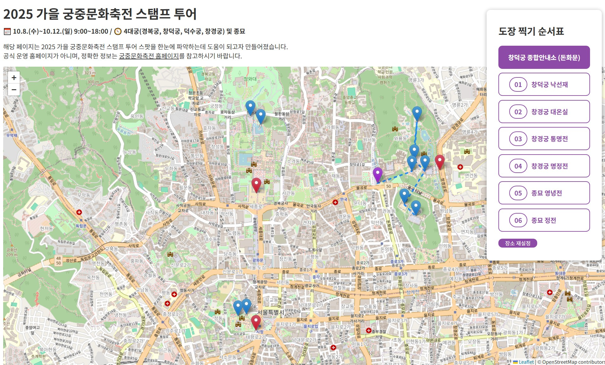

# 🍁 Stamp Tour



## 🎯 프로젝트 소개
- React 를 기반으로 하는 클라이언트 사이드 웹 어플리케이션
- 스탬프 투어 스팟 위치를 지도 위에 표시하여 보여주고, 사용자가 선택한 스팟을 순서표로 만들어 한눈에 파악하도록 돕는 프로그램

### 개발 기간
- 2025.10.03. ~ 2025.10.10. (8 days)

### 개발 인원
- 1명 (본인)

## 📁 파일 구조
```
stamp-tour
 ├ public/
 │  ├ index.html
 │  └ ...
 ├ src/
 │  ├ index.js
 │  ├ index.css
 │  └ components/
 │    ├ App.js
 │    ├ SideBar.js
 │    ├ StampMap.js
 │    └ ...
 ├ ...
 └ README.md
```

## 📚 사용 기술
### Frontend
- JavaScript, HTML, CSS: 웹 페이지의 기본 구조와 스타일 구성 및 사용자와 상호작용하는 동적 기능 구현
- React: component 와 JSX 의 사용으로 동일 코드의 반복을 줄이고 가독성을 향상, 웹 어플리케이션을 비교적 빠르게 구현
### Tools
- Git: 버전 관리와 코드 변경 이력 추적
- GitHub: 원격 저장소를 활용한 코드 작업 접근성 향상
- node.js: Node Package Manager 를 통하여 개발용 로컬 서버 (live-server)를 활용
- Visual Studio Code : JavaScript 기반 프로젝트의 코드 작성·실행·디버깅 지원

## ✨ 주요 기능
- 스탬프 투어 스팟 및 종합안내소 위치 표시
- 각 스팟을 선택하여로 스탬프 투어 순서표에 추가
- 선택된 스탬프 장소 구간별 연결선 표시

## 🚀 실행 방법
```
git clone https://github.com/seoyeonum/stamp-tour.git
cd stamp-tour
npm install
npm start
```