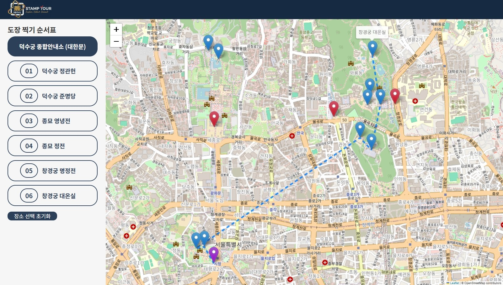
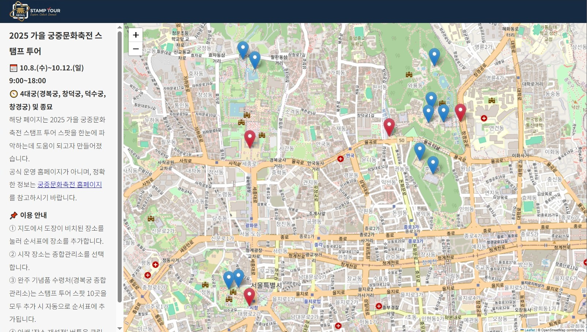
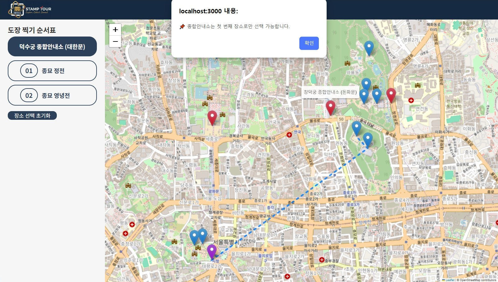
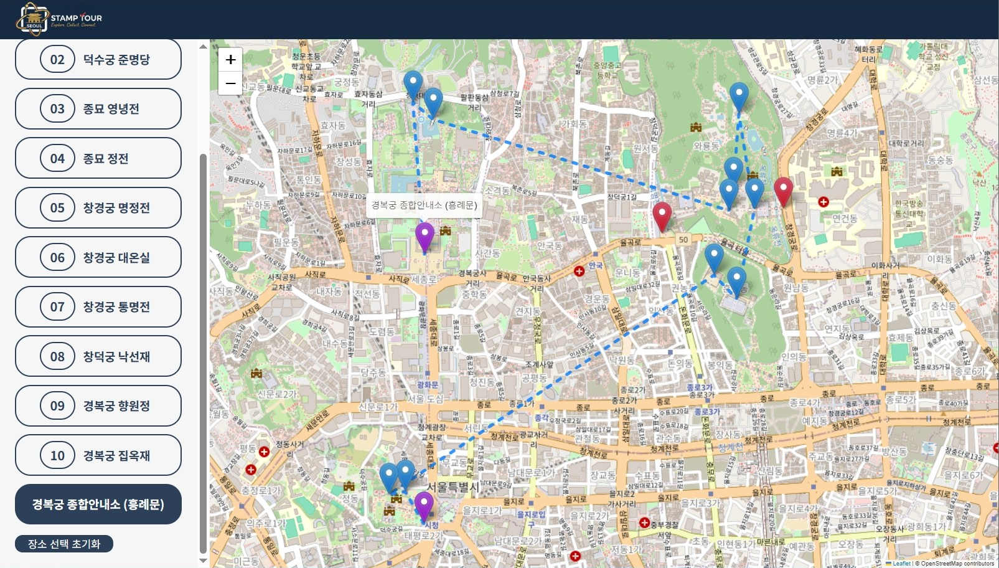

<!-- 소개/기술/기능/스크린샷/실행링크 -->

# 📌 Stamp Tour



## 🎯 프로젝트 소개

- React 를 기반으로 하는 클라이언트 사이드 웹 어플리케이션
- 궁중문화축전 스탬프 투어 스팟 위치를 지도 위에 표시하여 보여주고, 사용자가 선택한 스팟을 순서표로 만들어 한눈에 파악하도록 돕는 프로그램
- 개발 기간: 2025.10.03. ~ (현재 진행중)
- 개발 인원: 1명 (본인)
- 실행 링크: [stamp-tour-amber.vercel.app](https://stamp-tour-amber.vercel.app)

## 📚 사용 기술

- **Frontend**: React, JavaScript, HTML, CSS
- **Tools**: Git, GitHub, node.js, Vercel, VSCode

## ✨ 주요 기능

- 이용 안내 및 스탬프 투어 장소 출력 기능
  </br>
- 선택 가능한 장소 제한 기능
  </br>
- 스탬프 투어 장소 선택/삭제 기능 (순서표, 지도)
  </br>

## 📁 파일 구조

```
stamp-tour
 ├ public/
 │  ├ index.html
 │  └ ...
 ├ src/
 │  ├ index.js
 │  ├ index.css
 │  └ components/
 │    ├ App.js
 │    ├ Description.js
 │    ├ SpotList.js
 │    └ StampMap.js
 ├ ...
 └ README.md
```

## 🚀 실행 방법

### 1. 배포 버전

다음 링크([stamp-tour-amber.vercel.app](https://stamp-tour-amber.vercel.app))에서 확인 가능

### 2. 로컬 실행

```
git clone https://github.com/seoyeonum/stamp-tour.git
cd stamp-tour
npm install
npm start
```
