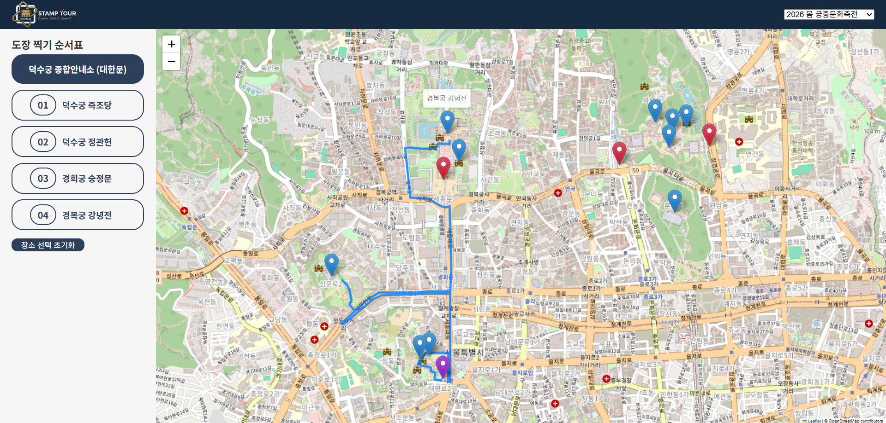

<!-- ---------- 1. 타이틀과 간략 소개 ---------- -->

# 📌 Stamp Tour App

사용자가 지도 위 장소를 선택하여 순서표를 구성하면
예상 경로를 지도 위에 보여주는 궁중문화축전 스탬프 투어 플래너

> Ongoing Personal Project (Latest Update: 2026.05.)

<!-- ---------- 2. Demo ---------- -->

## 실행 링크

🔗 Live Demo : [stamp-tour-amber.vercel.app](https://stamp-tour-amber.vercel.app)



<!-- ---------- 3. Project Overview ---------- -->

## 제작 동기

매년 봄과 가을 진행되는 궁중문화축전 스탬프 투어를 더 빠르게 돌기 위해 제작,
기존 지도 앱에 표시하기 어려운 투어 장소와 순서를 한눈에 파악 가능

<!-- ----------  4. Key Features ----------  -->

## 핵심 기능

- 스탬프 투어 장소 및 순서 시각화

- 순서표 자동 스크롤 및 지도와 장소 선택 연동

- 스탬프 투어 시즌 선택 기능

- OSRM API 기반 도보 경로 렌더링

- 모바일 환경 반응형 UI 구성

- 선택 장소 해제 및 인터랙션 개선

<!-- ---------- 5. Tech Stack ---------- -->

## 사용 기술

- **Front-end**: React, JavaScript, HTML, CSS
- **API**: Leaflet API, OSRM API
- **Version Control**: GitHub
- **Deployment**: Vercel
- **IDE**: VSCode

<!-- ---------- 6. Implementation Details or Trouble Shooting ---------- -->

## 세부 구현 내용

- 지도와 순서표의 선택 장소 연동
  : 지도 상에서 Marker 클릭 시 선택 장소를 useState 배열로 저장, 배열 기반 순서표 동기화

- OSRM API를 활용하여 실제 도보 이동을 가정한 경로 렌더링
  : 출발/도착 장소 좌표 기반의 API 요청, 응답 받은 polyline을 지도에 렌더링

- 미디어 쿼리 조건 분기를 통한 반응형 UI 구성
  : viewport를 기준으로 모바일 환경 접속 시 기존 Sidebar를 하단으로 전환

- useRef를 활용하여 중복 API 요청 방지
  : useEffect를 통해 장소 선택 상태 변경 감지, useRef를 활용하여 동일 경로 렌더링 최소화

## 문제 해결 기록

- 스탬프 투어 시즌 변경 시 선택 시즌에 따른 투어 장소 표기가 불가능하던 문제

  : 전체 스탬프 투어 장소를 단순 iterate하여 출력하는 구조에 따라 매년 변경되는 장소 표기 불가,
  장소/시즌 데이터 분리 및 useEffect 활용하여 season 상태 변경에 따른 투어 장소 추출 및 시각화

- 투어 장소 선택 시 순서표를 채워갈수록 장소 간 경로 렌더링이 지연되던 문제

  : useEffect 의존성 배열 상태 변경에 따라 컴포넌트 리렌더링 및 경로 API가 불필요하게 반복 호출,
  useRef로 이전 요청에 따른 경로 상태를 저장하여 중복 요청 방지 및 전체 렌더링 시간 기존 대비 87.9% 단축 (47.844s to 5.762s)

- 순서표 완성 이후 초기화 없이 장소 선택 취소 시 최종 장소가 사라지지 않던 문제

  : 최종 장소는 선택된 투어 장소 개수 의존적으로 추가되는 방식으로 사용자가 직접 선택 취소 불가,
  선택된 투어 장소 배열의 길이와 마지막 구성요소를 조건문 통해 비교 후 Array.slice() 활용하여 최종 장소 제거

<!-- ---------- 7. Development Timeline ---------- -->

## 개발 타임라인

- 2025.10.03. ~ 2025.10.28.

  > Initial implementation
  > : 기본 Marker, 순서표, 연결선 렌더링 구현

- 2026.02.03. ~ 2026.02.04.

  > UI redesign & component restructuring  
  > : UI 디자인 개편 및 컴포넌트 구조 변경

- 2026.03.05. ~ 2026.03.12.

  > UX enhancement update  
  > : 자동 스크롤, 모바일 반응형 하단바, 장소 선택 해제 기능 구현

- 2026.04.23 ~ 2026.05.04
  > Season update & route rendering
  > : 시즌 선택 기능, OSRM API 실제 경로 렌더링, request 최적화

<!-- ---------- 8. Branch Strategy / Version History ---------- -->

## 브랜치 운영 방식

작업 초기에는 main 브랜치로 직접 개발, 이후 배포 중단 없이 개발 위해 develop 브랜치 분리 운영

- main : production
- develop : upcoming features

## 로컬 실행 방법

```
git clone https://github.com/seoyeonum/stamp-tour.git
cd stamp-tour
npm install
npm start
```

<!-- ---------- 9. Future Plans ---------- -->

## 향후 구현 예정 기능

- Ongoing
  > localStorage 저장, SPA 전환, 실시간 위치 기반 스탬프 획득, 인증 배지 기능
